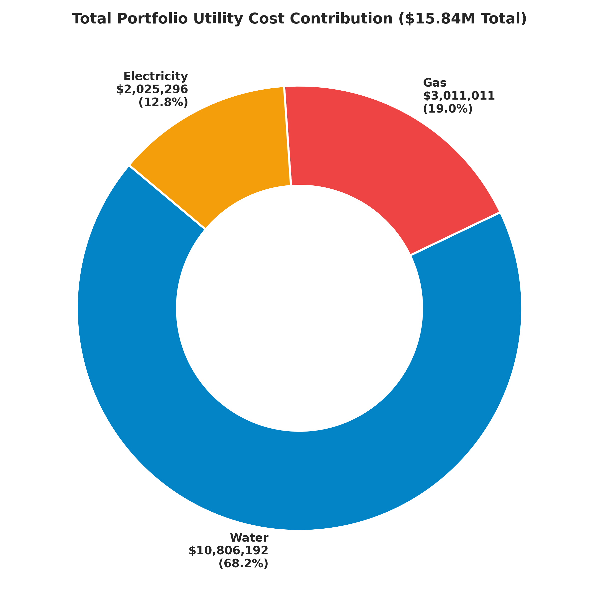
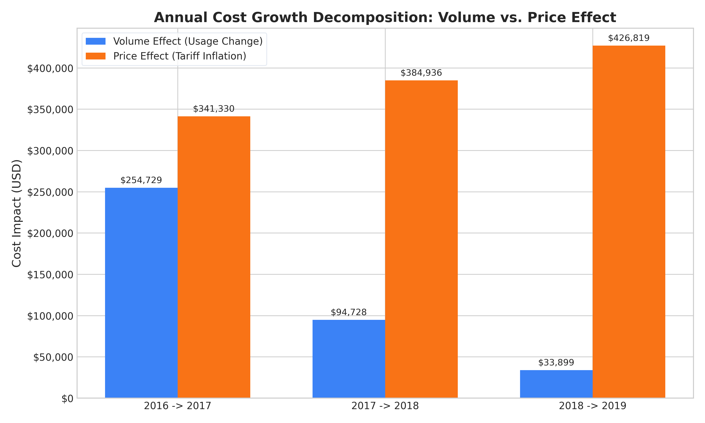
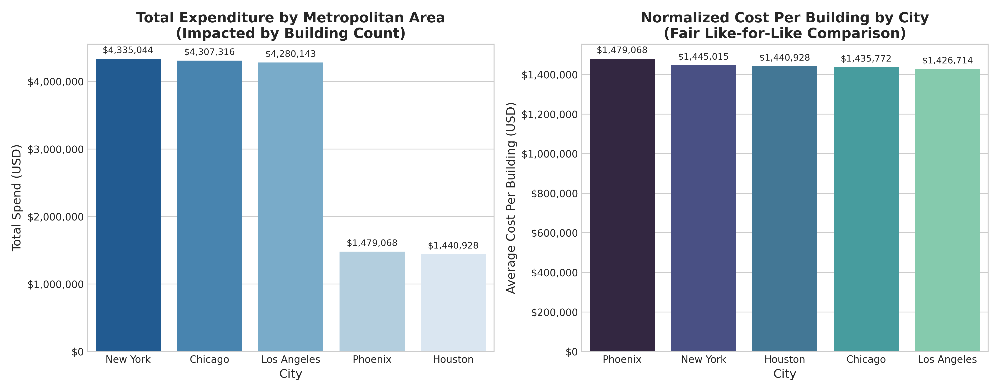
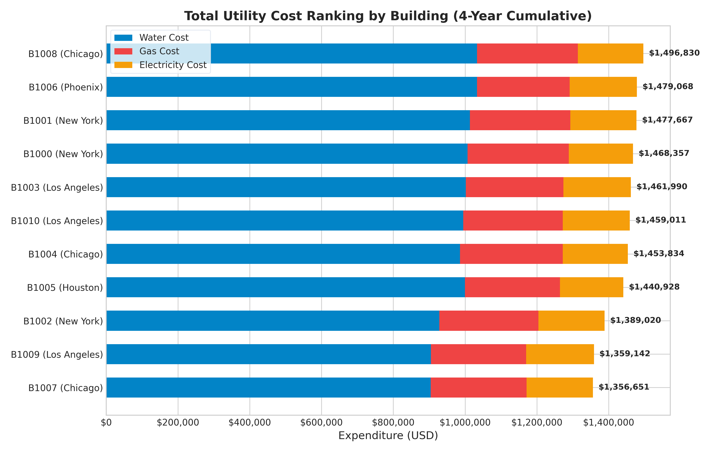

# Energy Consumption & Business Performance Analytics

<<<<<<< HEAD
[](https://www.python.org/)
[](https://www.sqlite.org/)
[](https://powerbi.microsoft.com/)
[](https://opensource.org/licenses/MIT)

An enterprise analytics engineering and business intelligence portfolio project evaluating energy consumption, operational expenditures, price versus volume decomposition, and building performance across 11 commercial properties over a 48-month horizon.

---

## 1. Executive Summary

This project transforms an educational Edunet Foundation internship assignment into a production-grade, interview-ready **Business Performance Analytics case study**. Utilizing a real-world multi-utility dataset, the study investigates:
- Portfolio OpEx drivers across **\$15,842,498.96** in total expenditure.
- Why expenditure surged **+48.64%** between 2016 and 2019 despite flat operational water consumption.
- A zero-residual **Price vs. Volume Variance Decomposition** isolating uncontrollable utility tariff hikes from operational conservation.
- Regional efficiency normalization resolving severe municipal **aggregation bias**.

---

## 2. Business Problem & Analytical Objectives

Large commercial real estate operators frequently struggle with scattered utility billing and disconnected spreadsheets. Without unified analytics:
1. **Misallocated Conservation Capital:** Organizations invest heavily in electrical retrofits while failing to realize that water tariffs represent nearly 70% of utility OpEx.
2. **Management Accountability Distortion:** Facility managers are unfairly penalized for utility cost surges caused purely by compounding municipal rate hikes rather than equipment waste.
3. **Misleading Regional Aggregates:** Comparing total city expenditures masks single-facility operational inefficiencies in smaller metropolitan footprints.

---

## 3. Dataset Architecture & Verified Grain

The analysis is grounded in verified source truth from `Energy Consumption Data.xlsx`.

| Entity | Grain / Dimensions | Time Horizon | Key Attributes | Data Quality Status |
| :--- | :--- | :--- | :--- | :--- |
| **Fact Table (`Energy Consumptions`)** | 1 row per Building per Month<br>**(528 rows × 5 cols)** | 48 months<br>(2016-01 to 2019-12) | `Date`, `Building`, `Water Consumption`, `Electricity Consumption`, `Gas Consumption` | 100% complete, 0 nulls, 0 duplicate keys, 0 non-positive values |
| **Dimension (`Building Master`)** | 1 row per Facility<br>**(11 rows × 3 cols)** | Fixed | `Building` (`B1000`-`B1010`), `City` (5 cities), `Country` (`USA`) | 100% mapped; 3 NY, 3 LA, 3 CHI, 1 PHX, 1 HOU |
| **Dimension (`Rates`)** | 1 row per Year per Utility<br>**(15 rows × 3 cols)** | 2016 – 2020 | `Year`, `Energy Type`, `Price Per Unit` (\$) | Verified: Compounding +10.0% p.a. rate escalation |

```
                       +-----------------------------+
                       |        dim_calendar         |
                       +-----------------------------+
                       | Date (PK)                   |
                       | Year, Quarter, Month, Y-M   |
                       +--------------+--------------+
                                      |
                                      | 1:N
                                      v
+------------------------+  +-----------------------------+  +------------------------+
|      dim_building      |  |   fact_energy_consumption   |  |        dim_rate        |
+------------------------+  +-----------------------------+  +------------------------+
| building_id (PK)       |<-| consumption_id (PK)         |->| rate_year (PK)         |
| city                   |  | consumption_date (FK)       |  | energy_type (PK)       |
| country                |  | building_id (FK)            |  | price_per_unit         |
+------------------------+  | water_consumption           |  +------------------------+
                            | electricity_consumption     |
                            | gas_consumption             |
                            +-----------------------------+
```

---

## 4. Key Analytical Insights

### 4.1 Water Dominates Enterprise Utility Spend (68.21%)
Water represents **\$10,806,192.07** out of \$15.84M total portfolio spend. Natural Gas accounts for **\$3,011,010.87** (19.01%), while Electricity accounts for **\$2,025,296.02** (12.78%). Sustainability CapEx directed at water conservation delivers over 5x the financial return of electrical efficiency programs.



### 4.2 Price vs. Volume Decomposition: Tariff Inflation Drives Cost Growth
Between 2016 and 2019, portfolio expenditure escalated by **+\$1.54M (+48.64%)**. 
- In **2016 -> 2017**, growth was split: **42.74% Volume Effect** vs. **57.26% Price Effect**.
- By **2018 -> 2019**, **92.64% of cost growth was driven by external tariff increases**, while operational water volume actually dropped by **-3.48%**.



### 4.3 Resolving Regional Aggregation Bias: Phoenix vs. New York
Total city expenditure indicates New York is the largest cost center (\$4.34M) and Phoenix is second-lowest (\$1.48M). However, New York contains 3 buildings while Phoenix has only 1. 
- On a **Normalized Cost Per Building** basis, **Phoenix is the single most expensive facility in the portfolio (\$1,479,068.04)**, exceeding New York (\$1.45M/bldg) and Los Angeles (\$1.43M/bldg).



### 4.4 Cumulative Building Performance Ranking
Building `B1008` (Chicago) registered the highest cumulative spend at **\$1,496,830.40**, whereas `B1007` (Chicago) operated at **\$1,356,651.48**—a **\$140,178.92 (+10.3%)** performance spread within the exact same climate and municipal tariff zone.



---

## 5. Technology Stack

- **Data Engineering & Preprocessing:** Python 3.12, Pandas, NumPy
- **Relational Modeling & Analytics:** ANSI SQL, SQLite 3, CTEs, Window Functions (`RANK`, `DENSE_RANK`, `LAG`, `LEAD`, rolling frames)
- **Data Visualization:** Matplotlib, Seaborn
- **Business Intelligence:** Microsoft Power BI Desktop, DAX
- **Quality Assurance:** Custom automated verification test harness

---

## 6. Project Directory Structure

```
energy-business-analytics/
├── data/
│   ├── raw/                              # Untouched source datasets
│   │   ├── Energy Consumption Data.xlsx
│   │   └── Data Analytics Assignment 1.xlsx
│   └── processed/                        # Certified clean & enriched data
│       ├── energy_consumption_processed.csv
│       ├── energy_consumption_processed.parquet
│       └── energy_consumption_enriched.csv
├── src/                                  # Modular analytics engineering codebase
│   ├── __init__.py
│   ├── data_validation.py                # Automated data quality & integrity checks
│   ├── preprocessing.py                  # Standardized cleaning & dimension joins
│   ├── feature_engineering.py            # Utility cost & Price-Volume decomposition
│   ├── kpi_analysis.py                   # Multi-tier KPI calculation engine
│   ├── anomaly_detection.py              # IQR & Z-score operational outlier detection
│   ├── generate_charts.py                # Publication-grade chart renderer
│   └── run_pipeline.py                   # Automated end-to-end pipeline runner
├── sql/                                  # Production SQL analytics suite
│   ├── schema.sql                        # DDL Star Schema and Master Mart View
│   ├── data_quality.sql                  # Automated SQL test assertions
│   ├── kpi_analysis.sql                  # Annual spend, utility share, monthly metrics
│   ├── building_analysis.sql             # Ranking, utility mix, facility growth
│   ├── geographic_analysis.sql           # Total vs normalized city performance
│   ├── trend_analysis.sql                # MoM, YoY, rolling averages, extremes
│   └── run_sql_suite.py                  # In-memory SQL test engine & validator
├── notebooks/                            # Documented Jupyter notebooks
│   ├── 01_data_audit.ipynb               # Raw data profiling & integrity audit
│   ├── 02_data_preparation.ipynb        # Preprocessing & cost engineering
│   └── 03_exploratory_analysis.ipynb     # Comprehensive visual EDA
├── reports/                              # Executive documentation
│   ├── methodology.md                    # Data model, formulas & architecture
│   ├── business_insights.md              # Structured findings & recommendations
│   ├── limitations.md                    # Methodological constraints & defense
│   ├── validation_report.md              # Cross-tool reconciliation certification
│   ├── power_bi_dax_and_model_guide.md   # Semantic model & DAX blueprint
│   └── sql_execution_report.md           # Markdown report of all SQL outputs
├── outputs/
│   ├── cleaned_data/                     # Power BI ready dimensional exports
│   │   ├── dim_calendar.csv
│   │   ├── dim_building.csv
│   │   ├── dim_rate.csv
│   │   ├── fact_energy_consumption.csv
│   │   └── energy_master_flat.csv
│   ├── charts/                           # High-resolution 300 DPI visuals
│   │   ├── 01_monthly_utility_cost_trend.png
│   │   ├── 02_utility_cost_contribution_share.png
│   │   ├── 03_price_vs_volume_decomposition.png
│   │   ├── 04_annual_cost_by_utility.png
│   │   ├── 05_building_total_cost_ranking.png
│   │   ├── 06_city_total_vs_normalized_cost.png
│   │   ├── 07_seasonal_consumption_patterns.png
│   │   ├── 08_monthly_mom_yoy_volatility.png
│   │   └── 09_anomaly_detection_scatter.png
│   └── summary_tables/                   # Analytical summary tables (CSV / JSON)
│       ├── portfolio_kpis.json
│       ├── annual_growth_kpis.csv
│       ├── building_kpis.csv
│       ├── geographic_kpis.csv
│       ├── price_vs_volume_decomposition.csv
│       ├── anomaly_detection_report.csv
│       └── sql_results/                  # Query CSV exports
├── PROJECT_AUDIT.md                      # Complete audit of legacy Edunet assets
├── requirements.txt                      # Minimal pinned package dependencies
└── README.md
```

---

## 7. How to Run the Project

### Prerequisites
- Python 3.10+ installed
- Install minimal dependencies:
```bash
pip install -r requirements.txt
```

### 1. Execute End-to-End Python Pipeline
Executes automated data validation, preprocessing, cost engineering, KPI generation, anomaly detection, and chart rendering:
```bash
python src/run_pipeline.py
```

### 2. Execute SQL Analytics Test Suite
Initializes an in-memory SQLite relational database, runs schema DDL, verifies data quality assertions, executes all 20 business queries, and confirms exact reconciliation against Python:
```bash
python sql/run_sql_suite.py
```

### 3. Open Interactive Notebooks
Launch Jupyter to explore audit, data prep, and EDA workflows:
```bash
jupyter notebook notebooks/
```

---

## 8. Strategic Business Recommendations

1. **Target Water Efficiency First:** Reallocate facility CapEx toward cooling tower water sub-metering, low-flow fixtures, and booster pump optimization to address the 68.2% cost driver.
2. **Institute Rate-Adjusted Executive Scorecards:** Evaluate facility managers on controllable consumption volume variances rather than gross spend, shielding them from external rate inflation.
3. **Investigate Natural Gas Spikes:** Audit heating boiler combustion and setback schedules to curb the +103% four-year expansion in gas spend.
4. **Conduct Engineering Audits on Outlier Facilities:** Benchmark `B1008` (Chicago) against `B1007` (Chicago) to capture potential recurring savings of up to \$35,000/year.

---

## 9. Interview Readiness & Technical Defensibility

| Technical Dimension | Evidence / Implementation in Codebase |
| :--- | :--- |
| **Data Cleaning** | Automated 7-point validation suite checking schema, nulls, composite keys, dates, and referential integrity (`src/data_validation.py`). |
| **Financial Engineering** | Multiplied consumption by annual utility tariffs; computed utility shares, rolling averages, and growth metrics (`src/feature_engineering.py`). |
| **Advanced SQL** | Star Schema DDL, master mart view, and 20 business queries leveraging CTEs, `RANK()`, `DENSE_RANK()`, `LAG()`, `LEAD()`, and rolling window frames (`sql/`). |
| **Variance Decomposition** | Exact mathematical isolation of Volume Effect vs. Price Effect with zero residual (`src/feature_engineering.py`). |
| **Power BI & DAX** | 20+ documented enterprise DAX measures, star schema dimensional model, and 5-page executive dashboard layout (`reports/power_bi_dax_and_model_guide.md`). |
| **Cross-Tool Reconciliation**| Python pipeline, SQL master view, and Power BI measures reconcile to **\$15,842,498.96** (<10 cent rounding variance). |

---
*Created as part of the OJ Commerce Analyst / Analytics Engineering Case Study Portfolio.*
=======
An interactive Power BI dashboard designed to analyze energy consumption, utility costs, and building-level business performance across multiple cities and buildings from 2016–2019.

## 📊 Project Overview

This project transforms energy consumption and utility cost data into an interactive business intelligence dashboard using Microsoft Power BI.

The dashboard provides insights into:

- Overall utility expenditure
- Monthly and annual cost trends
- Electricity, gas, and water costs
- Energy consumption patterns
- Building-level performance
- City-level cost comparison
- Utility cost distribution
- Consumption comparison across buildings

## 🎯 Objectives

- Analyze overall utility expenditure and consumption.
- Identify cost trends across years.
- Compare utility costs across cities.
- Evaluate building-level utility performance.
- Analyze electricity, gas, and water consumption.
- Provide interactive filtering for business analysis.
- Present complex energy data through clear visualizations.

## 🛠️ Technologies Used

- Microsoft Power BI
- DAX
- Power Query
- Data Modeling
- Data Visualization

## 🗂️ Data Model

The project uses a dimensional data model consisting of:

### Fact Table

**fact_energy_consumption**

Contains energy consumption records for buildings and dates.

Key fields:

- Building
- Date
- Electricity Consumption
- Gas Consumption
- Water Consumption

### Dimension Tables

**dim_calendar**
- Date
- Year
- Month
- Quarter
- Year-Month
- Year-Quarter

**dim_building**
- Building
- City
- Country

**dim_rate**
- Energy Type
- Price Per Unit
- Year

**dim_utility**
- Utility

This structure enables efficient filtering, aggregation, and time-based analysis.

## 📐 DAX Measures

The dashboard includes DAX measures for:

- Total Utility Cost
- Total Electricity Cost
- Total Gas Cost
- Total Water Cost
- Total Electricity Consumption
- Total Gas Consumption
- Total Water Consumption
- Average Monthly Cost
- Previous Year Cost
- YoY Cost Growth %
- Electricity Cost %
- Gas Cost %
- Water Cost %
- Average Cost per Building

## 📈 Dashboard Pages

### Page 1 — Executive Overview

Provides a high-level summary of business performance through:

- Total Utility Cost KPI
- Average Monthly Cost KPI
- Total Buildings KPI
- Total Months KPI
- Annual Utility Cost Trend
- Annual Cost Analysis
- Utility Distribution
- Cost by City
- Year slicer
- City slicer
- Building slicer

### Page 2 — Building Performance & Cost Analysis

Focuses on building-level analysis through:

- Utility Cost by Building
- Utility Cost by City
- Utility Consumption by Building
- Building-level performance table
- Total Utility Cost
- Average Monthly Cost
- Average Cost per Building

## 📌 Key Dashboard Metrics

Based on the dashboard:

- **Total Utility Cost:** approximately $15.84M
- **Total Buildings:** 11
- **Total Months:** 48
- **Cities:** 5
- **Analysis Period:** 2016–2019

## 💡 Business Insights

The dashboard enables stakeholders to:

- Identify high-cost buildings.
- Compare utility expenditure between cities.
- Track annual changes in utility costs.
- Understand the contribution of water, gas, and electricity to total expenditure.
- Identify buildings with higher utility consumption.
- Support data-driven energy management and cost optimization decisions.

## 🖼️ Dashboard Preview

### Executive Overview


### Building Performance & Cost Analysis


## 🚀 How to Use

1. Download the `.pbix` Power BI file.
2. Open it using Microsoft Power BI Desktop.
3. Refresh the data if the required data source is available.
4. Use the slicers to filter the dashboard by:
   - Year
   - City
   - Building
5. Interact with the visuals to explore cost and consumption patterns.

## 📁 Project Files

| File | Description |
|---|---|
| `Energy_Business_Performance_Analytics.pbix` | Power BI dashboard |
| `screenshots/` | Dashboard preview images |
| `README.md` | Project documentation |

## 👨‍💻 Author

**Arvindh Babu V**

B.Tech — Artificial Intelligence & Data Science

GitHub: https://github.com/Arvindhbabu

Portfolio: https://arvindhbabu.github.io/Portfolio/

## 📄 License

This project is intended for educational and portfolio purposes.
>>>>>>> origin/main
